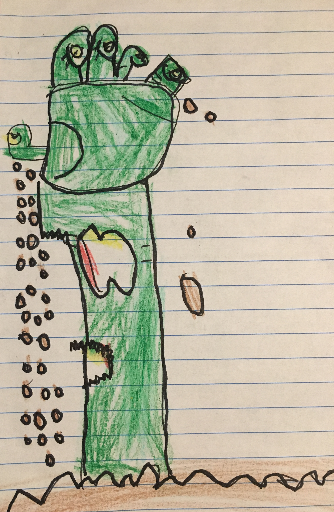

# Skate It/ Rate It
## The App for DIY Skatepark Enthusiasts
#### Udacity iOS Developer Nanodegree Capstone project

## Background
  Skateboarding is not a crime! In fact, it is an artistic and creative way to express yourself and challenge your abilities. Skate parks built by professionals are in short supply , highly regulated, and often close at dark. Skateboarders tend to carry a bad (often misleading) reputation. 
  Skate culture has become more collaborative and supportive regarding unused spaces where local businesses allow private citizens to build a Do It Yourself skate spot. Skaters are free to come and go, create additional features, and skate free of regulations and time limits. SkateIt/RateIt allows users to display where these DIY spots are located so others may enjoy them, too. 
  
## User Experience

#### Image Citation
The AppIcon image is of the Foundation Spot in Asheville, NC. Photography credit goes to Eclipse Carbon (Aug. 2016)

      
The Launch Screen image is an original artwork by my 6 year old daughter who loves to skate with her daddy. 

The ebay.com store belongs to Jeremy Lyndon (husband).  

      

